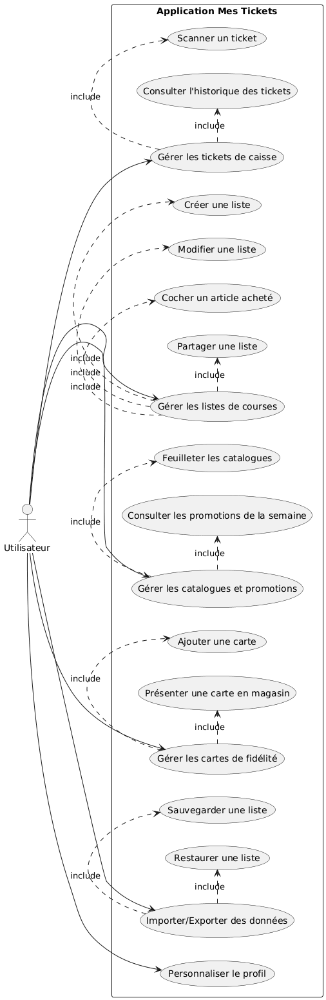

# **Mes Tickets - Documentation Technique**


## 📋 Table des Matières
- [Vue d'Ensemble](#vue-densemble)
- [Fonctionnalités](#fonctionnalités)
- [Architecture Technique](#architecture-technique)
- [Diagramme des Cas d'Utilisation](#diagramme-des-cas-dutilisation)
- [Stack Technologique](#stack-technologique)
- [Modèle de Données](#modèle-de-données)
- [API Endpoints](#api-endpoints)
- [Guide d'Installation](#guide-dinstallation)
- [Déploiement](#déploiement)
- [Sécurité](#sécurité)

---

## 🎯 Vue d'Ensemble

**Mes Tickets** est une application tout-en-un qui digitalise la gestion quotidienne des achats et des courses. Elle combine quatre fonctionnalités principales dans une interface unifiée :

### Mission
> "Participons ensemble à préserver l'environnement" en réduisant le papier grâce à la digitalisation des tickets de caisse, listes de courses, catalogues et cartes de fidélité.

### Cibles
- 🛒 **Consommateurs** : Gestion simplifiée des achats
- 🌱 **Écologistes** : Réduction de l'empreinte papier
- 🏪 **Commerces locaux** : Promotion digitale des offres
- 👨‍👩‍👧‍👦 **Familles** : Partage et collaboration sur les listes

---

## ✨ Fonctionnalités

### 📄 **1. Tickets de Caisse Numériques**
| Fonctionnalité | Description | Avantage |
|---------------|------------|----------|
| **Scanner de tickets** | Capture via caméra | Plus de tickets papier |
| **Historique** | Recherche et filtres avancés | Trouver un achat |

### 🛒 **2. Listes de Courses Collaboratives**
| Fonctionnalité | Description | Avantage |
|--------------|-------------|----------|
| **Partage** | Multi-utilisateurs | Courses en famille |
| **Cocheur d'articles** | Interface tactile optimisée | Pas d'oubli |
| **Synchronisation offline** | Travail sans connexion | Utilisation partout |

### 📢 **3. Catalogues & Promotions**
| Fonctionnalité | Description | Avantage |
|---------------|-------------|----------|
| **Bibliothèque de catalogues** | Accès aux catalogues des commerçants | Centralisation |
| **Alertes promotions** | Notifications personnalisées | Économies ciblées |
| **Favoris** | Épinglage des bonnes affaires | Rappels intelligents |

### 💳 **4. Cartes de Fidélité Digitales**
| Fonctionnalité       | Description | Avantage |
|----------------------|-------------|----------|
| **Scan**             | Digitalisation des cartes physiques | Portefeuille allégé |
| **QR Code intégré**  | Présentation en magasin | Rapidité en caisse |

### 🔄 **5. Import/Export & Sauvegarde**
| Fonctionnalité | Description |
|---------------|-------------|
| **Sauvegarde** | Synchronisation sécurisée |

---

## 🏗️ Architecture Technique

### Schéma d'Architecture

```
┌─────────────────────────────────────────────────────────────┐
│                    COUCHE PRÉSENTATION                      │
├─────────────────────────────────────────────────────────────┤
│  ┌─────────────────┐        ┌─────────────────────────┐    │
│  │   Application   │        │     Dashboard Web       │    │
│  │    Flutter      │        │       Angular           │    │
│  │  (Mobile App)   │        │   (Interface Admin)     │    │
│  └─────────────────┘        └─────────────────────────┘    │
│           │                            │                    │
│           │ HTTPS/JSON                 │ HTTPS/JSON         │
└───────────┼────────────────────────────┼────────────────────┘
            │                            │
            ▼                            ▼
┌─────────────────────────────────────────────────────────────┐
│                    COUCHE APPLICATION                       │
├─────────────────────────────────────────────────────────────┤
│                                                             │
│          ┌─────────────────────────────────────┐           │
│          │        API REST Spring Boot         │           │
│          │                                     │           │
│          │  Controllers  →  Services  →  Repos │           │
│          │                                     │           │
│          └─────────────────────────────────────┘           │
│                      │           │           │              │
│                Cache │           │           │ File Storage │
└──────────────────────┼───────────┼───────────┼──────────────┘
                       │           │           │
                       ▼           ▼           ▼
┌─────────────────────────────────────────────────────────────┐
│                    COUCHE PERSISTANCE                       │
├─────────────────────────────────────────────────────────────┤
│                                                             │
│          ┌─────────────────────────────────────┐           │
│          │       Base de Données PostgreSQL    │           │
│          │                                     │           │
│          │  • utilisateurs                     │           │
│          │  • tickets                          │           │
│          │  • listes_courses                   │           │
│          │  • catalogues                       │           │
│          │  • cartes_fidelite                  │           │
│          │  • transactions                     │           │
│          │                                     │           │
│          └─────────────────────────────────────┘           │
└─────────────────────────────────────────────────────────────┘
```

### Composants Clés

#### **1. Application Mobile (Flutter)**
- **Framework** : Flutter 3
- **UI/UX** : Material Design 3, animations natives
- **Permissions** : Caméra, stockage

#### **2. Dashboard Web (Angular)**
- **Framework** : Angular 16
- **Authentification** : JWT

#### **3. Backend API (Spring Boot)**
- **Framework** : Spring Boot 3, Java
- **Sécurité** : Spring Security, JWT
- **Persistence** : Spring Data JPA, Hibernate
- **Documentation** : SpringDoc OpenAPI 3

#### **4. Base de Données (PostgreSQL)**
- **Version** : PostgreSQL
- **Performances** : Indexation

---

## 📊 Diagramme des Cas d'Utilisation


### Flux Utilisateur Typique

1. **Enregistrement** → Création de profil + préférences
2. **Scan initial** → Digitalisation des tickets/cartes existants
3. **Utilisation quotidienne** :
  - Scan de nouveaux tickets
  - Mise à jour des listes
  - Consultation des promotions

---

## 🛠️ Stack Technologique

### **Frontend Mobile (Flutter)**

### **Frontend Web (Angular)**

### **Backend (Spring Boot)**


---

## 🗃️ Modèle de Données

### Schéma Principal

```sql
-- Table utilisateurs
CREATE TABLE utilisateurs (
    id UUID PRIMARY KEY DEFAULT gen_random_uuid(),
    email VARCHAR(255) UNIQUE NOT NULL,
    nom VARCHAR(100),
    prenom VARCHAR(100),
    mot_de_passe_hash VARCHAR(255),
    date_inscription TIMESTAMP DEFAULT CURRENT_TIMESTAMP,
    preferences JSONB
);

-- Table tickets
CREATE TABLE tickets (
    id UUID PRIMARY KEY DEFAULT gen_random_uuid(),
    utilisateur_id UUID REFERENCES utilisateurs(id),
    nom_commerce VARCHAR(255),
    date_achat DATE NOT NULL,
    montant_total DECIMAL(10,2),
    scan_image_url TEXT,
    donnees_ocr JSONB, -- Résultat OCR structuré
    categories TEXT[],
    created_at TIMESTAMP DEFAULT CURRENT_TIMESTAMP
);

-- Table listes_courses
CREATE TABLE listes_courses (
    id UUID PRIMARY KEY DEFAULT gen_random_uuid(),
    utilisateur_id UUID REFERENCES utilisateurs(id),
    titre VARCHAR(255) NOT NULL,
    articles JSONB, -- [{nom: "Lait", quantite: 1, achete: false}]
    partage_avec UUID[], -- Liste d'IDs utilisateurs
    date_creation TIMESTAMP DEFAULT CURRENT_TIMESTAMP,
    date_modification TIMESTAMP
);

-- Table catalogues
CREATE TABLE catalogues (
    id UUID PRIMARY KEY DEFAULT gen_random_uuid(),
    commerce_id UUID,
    titre VARCHAR(255),
    periode_debut DATE,
    periode_fin DATE,
    fichier_pdf_url TEXT,
    promotions JSONB,
    zone_geographique VARCHAR(100)
);

-- Table cartes_fidelite
CREATE TABLE cartes_fidelite (
    id UUID PRIMARY KEY DEFAULT gen_random_uuid(),
    utilisateur_id UUID REFERENCES utilisateurs(id),
    nom_commerce VARCHAR(255),
    numero_carte VARCHAR(100),
    qr_code_data TEXT,
    points_actuels INTEGER DEFAULT 0,
    date_expiration DATE,
    image_recto_url TEXT,
    image_verso_url TEXT
);
```

### Relations
```
Utilisateur (1) ── (N) Ticket
Utilisateur (1) ── (N) ListeCourses
Utilisateur (1) ── (N) CarteFidelite
ListeCourses (N) ── (N) Utilisateur (via partage)
Catalogue (N) ── (1) Commerce
```

---

## 📦 Guide d'Installation

### Prérequis
```bash
# Pour le backend
Java 17
Maven 3.8
PostgreSQL

# Pour le frontend mobile
Flutter 3
Android Studio

# Pour le dashboard web
Node.js 18
Angular CLI 16
```

### Installation Pas à Pas

#### 2. Backend Spring Boot
```bash
cd backend

# Configuration
cp application.properties.example src/main/resources/application.properties
# Éditer les propriétés de connexion BD

# Compilation
mvn clean install

# Exécution
mvn spring-boot:run
# API disponible sur http://localhost:8080
```

#### 3. Application Mobile Flutter


#### 4. Dashboard Web Angular
```bash
cd dashboard

# Installation
npm install

# Développement
ng serve
# Disponible sur http://localhost:4200
```

### Docker Compose (Déploiement rapide)

```bash
docker-compose up -d
```

---

## 🚀 Déploiement

### Environnements
| Environnement | URL                  | Usage |
|--------------|----------------------|-------|
| **Développement** | dev.mestickets.local | Tests des développeurs |
| **Production** | mes-tickets.fr       | Utilisateurs finaux |


### Monitoring
- **Logs** : ELK Stack (Elasticsearch, Logstash, Kibana)
---

### Dashboard d'Administration
- **Tableau de bord**
- **utilisateurs**
- **Performances**
- **Alertes**

---

### Structure du Projet
```
mes-tickets/
├── backend/                 # API Spring Boot
│   ├── src/main/java/com/mestickets/
│   │   ├── controller/     # Contrôleurs REST
│   │   ├── service/        # Logique métier
│   │   ├── repository/     # Accès données
│   │   ├── model/          # Entités JPA
│   │   └── security/       # Configuration sécurité
│   └── pom.xml
├── mobile-app/             # Application Flutter
│   ├── lib/
│   │   ├── screens/       # Écrans de l'app
│   │   ├── widgets/       # Composants réutilisables
│   │   ├── services/      # Appels API
│   │   └── models/        # Modèles Dart
│   └── pubspec.yaml
├── dashboard/              # Interface web Angular
│   ├── src/app/
│   │   ├── components/    # Composants Angular
│   │   ├── services/      # Services API
│   │   └── models/        # Interfaces TypeScript
│   └── angular.json
└── docs/                  # Documentation
    ├── api/              # Documentation OpenAPI
    ├── architecture/     # Diagrammes
    └── user-guide/      # Guides utilisateurs
```

---

**Version** : 2.0.0
**Dernière mise à jour** : Janvier 2024
**Statut** : 🟢 En Production
**Site Web** : [mestickets.com](https://mes-tickets.fr)

---

*"Un ticket numérique sauve un arbre, une application intelligente transforme vos habitudes."*
